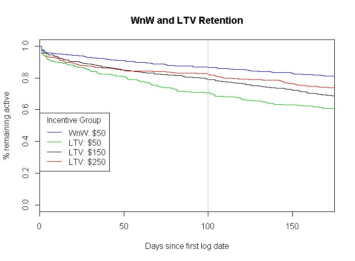

```{r setup, include=FALSE}
knitr::opts_chunk$set(echo = FALSE, fig.width = 7, fig.height = 5, fig.align = "center")

# File for producing Renew Motion report.  See ReadMe file in this repository for a list of other files that produce
# the inputs for this one.

setwd("R:/Users/ssmela/Renew Motion")

library(tidyverse)
library(survival)
library(knitr)

if(!exists("NPS")) load("NPS.rda")
if(!exists("GenResults")) load("GenResults.rda")
if(!exists("TrtGrps")) load("TrtGrps.rda")
if(!exists("PartResults")) load("PartResults.rda")
if(!exists("PartBothResults")) load("PartBothResults.rda")

Walkers <- rbind(PartResults, PartBothResults) %>%
  filter(Group < 3)

Walkers$Group <- c(1,2,3,4)

```

## Killer Question 1:  Does a program with the Fitbit platform and trackers increase NPS relative to the control group's results, past Trio-pilot results, and UHC's book-of-business baseline? 

We conducted two rounds of NPS calls, one before the invitation letters were sent (prior to March 23rd) and one after the walking program was launched (May 30th and later).  This report compares the changes in NPS between these two rounds of calls.


Some caveats:

1. Some individuals were (mistakenly) called more than once. I calculated NPS using the lowest and highest scores given by an individual in each round of calls.  The effect on the overall NPS was minimal (a change of .34 or less) and not statistically significant.  Nevertheless, in the comparisons below I use the maximum NPS from Round 1 and compare it to the minimum NPS from Round 2 in order to make the comparisons as strict as possible.

2. Some NPS data was (mistakenly) collected when participants called to enroll in Renew Motion.  This occurred between March 23rd and May 30th. These scores are not included in Round 1 vs. Round 2 comparisons.

Out of 16,333 members of the Renew Motion population, NPS data were collected from `r sum(is.na(NPS$Round1Max) == F)` in Round 1 and from `r sum(is.na(NPS$Round2Max) == F)` in Round 2.


### Overall Results

The first graph shows the change in NPS between Rounds 1 and 2. The left panel includes all responses from each round, while the right panel shows only responses from individuals who provided NPS data in both rounds (N = `r sum(is.na(NPS$Round1Max) == F & is.na(NPS$Round2Max) == F)`). 

Overall NPS increased by `r GenResults[2, 7]` points, from `r GenResults[1,5]` to `r GenResults[2,5]`, a statistically significant increase (*p* < .001).  In cases where we were able to contact someone in both rounds, NPS started from a higher baseline, `r GenResults[3,5]`, and increased `r GenResults[4,7]` points, to `r GenResults[4,5]`, also a statistically significant increase (*p* < .001). We'll see below that this increase cannot be attributed to the effects of Renew Motion. Perhaps it has something to do with the time of year.  Does NPS typically increase between March and May?

```{r GenResults, message=FALSE, warning=FALSE}

GenResults %>%
  ggplot() + 
  geom_point(aes(x = Group, y = NPS, color = PrePost)) +
  geom_errorbar(aes(x = Group, ymin = Lower, ymax = Upper, width = .2, color = PrePost)) +
  geom_vline(xintercept = 2.5,  lty = 1, size = .25, color = 'gray') +
  ylim(35,80) +
  labs(title = "Renew Motion Net Promoter Scores", y = "NPS", x = "") +
  scale_color_discrete(name = "") +
  scale_x_continuous(breaks = c(1.5, 3.5), 
                     labels = c("All Responses", "2 Responses from Same Person"))

```


### NPS by Treatment Group

The study population was divided into a control group and four treatment groups.  The control group was not offered Renew Motion.  The four treatment groups were Basic (offered Renew Motion); Bonus (received a $25 bonus after logging steps); Screening (invitation letter warned that unused devices would need to be returned); and Bonus + Screening.

The reason that the overall change in NPS can not be attributed to Renew Motion is that the change in NPS for the control group was `r TrtGrps[2,7]` points, which was exceeded only by the change in NPS for the Bonus group (`r TrtGrps[6,7]` points).  If simply offering a Motion program had an effect on NPS, we would expect that the change in each of the four treatment groups to be larger than the change for the control group, which is not the case.  In fact, the change for the Bonus + Screening group was only `r TrtGrps[8,7]` points, which was not statistically significant (*p* = `r TrtGrps[8,8]`).

```{r TrtGrps, message=FALSE, warning=FALSE}

TrtGrps %>%
  ggplot() + 
  geom_point(aes(x = Group, y = NPS, color = PrePost)) +
  geom_errorbar(aes(x = Group, ymin = Lower, ymax = Upper, width = .2, color = PrePost)) +
  geom_vline(xintercept = 2.5, lty = 1, size = .25, color = 'gray') +
  geom_vline(xintercept = 4.5, lty = 1, size = .25, color = 'gray') +
  geom_vline(xintercept = 6.5, lty = 1, size = .25, color = 'gray') +
  geom_vline(xintercept = 8.5, lty = 1, size = .25, color = 'gray') +
  ylim(35,80) +
  labs(title = "Renew Motion Net Promoter Scores", y = "NPS", x = "Treatment Group") +
  scale_color_discrete(name = "") +
  scale_x_continuous(breaks = c(1.5, 3.5, 5.5, 7.5, 9.5), 
                     labels = c("Control", "Basic", "Bonus", "Bonus + Screening", "Screening"))

```

### NPS for participants

While merely being *offered* a Motion program does not appear to affect NPS, *participating* in Renew Motion does  lead to increases in NPS that exceeded the change in the control group. The next figure shows changes in NPS for Renew Motion participants, using all responses (left panel) and just those where we had two responses from the same person.  We had `r Walkers[1,3]` Round 1 responses from participants, `r Walkers[2,3]` Round 2 responses, and `r Walkers[3,3]` cases where we had both Round 1 and Round 2 NPS ratings from the same individual participant.

The change in NPS was more than 13 points in each case, which was a significant difference (*p* = .004). 

```{r Participants, message=FALSE, warning=FALSE}

Walkers %>%
  ggplot() + 
  geom_point(aes(x = Group, y = NPS, color = PrePost)) +
  geom_errorbar(aes(x = Group, ymin = Lower, ymax = Upper, width = .2, color = PrePost)) +
  geom_vline(xintercept = 2.5,  lty = 1, size = .25, color = 'gray') +
  ylim(35,80) +
  labs(title = "Renew Motion Net Promoter Scores", subtitle = "Participants only", y = "NPS", x = "") +
  scale_color_discrete(name = "") +
  scale_x_continuous(breaks = c(1.5, 3.5), 
                     labels = c("All Responses", "2 Responses from Same Person"))

```


### How does this compare to other results?

Previous Savvysherpa studies using Trio devices achieved the following NPS results:

* Walk and Win (2016):  Sign-up call 77.6, 30-day follow-up 76.2
* Lifetime Value (2017): Welcome call 63.7, 30-day follow-up 58.2

These values are significantly higher than the overall Renew Motion results, even when omitting the scores from the control group. However, there are some important differences in how the data were collected. 

Most notably, the NPS from the previous studies included only participants in the walking program, so they are best compared to NPS for Renew Motion participants.

Second, the initial scores were obtained when participants were registering for the walking program. In contrast, the Renew Motion calls were made separately from registration.  As noted above, some Renew Motion NPS data were (mistakenly) collected when participants called to register.  Using these data, the NPS was 73.6, which compares favorably to the previous results.

In the previous studies, the NPS scores either stayed level or declined slightly.  In Renew Motion, NPS increased by over 13 points.  This provides evidence that a Fitbit-based program has a more beneficial effect on NPS than a Trio-based program.  However, there are differences in the timing of the calls (a 30-day lag versus a longer gap for Renew Motion) that may have had an impact.


Compared to the entire Renew Motion population, those who participated had higher Round 1 NPS levels (`r Walkers[1,5]` in the left panel above), so they were already favorably disposed towards United Health Group. After participating in the program, their NPS increased to `r Walkers[2,5]`.  One could make the case that a program like Renew Motion takes relatively satisfied customers and makes them even more satisfied, resulting in scores that approach the company's goal of 70 by 2013.

Finally, for UHC Medicare and Retirement, the 2017 NPS was 50, and the 2018 target is 55 (see "NPS Full Year 2017 - January," available on the company intranet). The final NPS for Renew Motion participants comfortably exceeds these targets.

## Killer Questions 2 and 3

Killer Question 2 is, "Does the Fitbit program achieve better enrollment, tracker use, retention, activity levels, and goal achievement than past Trio-based programs?"

And Killer Question 3 is, "Do an activation incentive and screener intervention reduce the rate of unused devices? Do they have other effects on enrollment or persistence?"

To answer these questions, I perform a number of comparisons. One set is between Renew Motion and previous Motion studies.  The other set uses the various treatment groups in the studies.

The important differences between the studies are the methods used to recruit participants and the structure of the rewards systems.

The two most relevant studies for comparison are the 2016 Walk and Win study and the 2017 Lifetime Value study ("WnW" and "LTV").  Like Renew Motion, these studies recruited from United Health's Medicare and Retirement customers.

Both Renew Motion and Walk sand Win contacted members by mail, and those who wished to participate needed to take action (calling or registering online) to enroll. For the Lifetime Value study, Savvysherpa telephoned the study population.  Those who were reached and agreed to participate were enrolled by the call agent.

In the previous two studies, members earned rewards for meeting two types of goals: Frequency (four walks of 180 steps in five minutes, at least an hour apart) and Tenacity (7500 steps per day).  For Renew Motion, the Tenacity goal was the same, but the Frequency goal was changed to 250+ steps in six of the nine hours between 9 a.m. and 6 p.m. This change was necessary to readily accommodate Fitbit's existing program capabilities.

In Walk and Win, members received \$0.25 for each goal met, for a maximum of \$0.50/day and an annual maximum of \$50.

In Lifetime Value, there were three incentive levels: \$0.25 per goal met, with a \$50 annual maximum; \$0.75 per goal met, with a \$150 annual maximum; and \$1.25 per goal met, with a \$250 annual maximum.

In Renew Motion, members received \$0.75 per goal met, with a \$150 annual maximum.  Additionally, as mentioned above, some members received a \$25 bonus for recording any steps. The bonus counted against their annual maximum.


```{r Enrollment, message=FALSE, warning=FALSE}

source("Renew Motion Master.R")
source("Enrollment and Engagement Analysis data prep.R")

NoControl2 <- Master %>% 
  filter(TrtGroup != "Control (Survey)") %>%
  mutate(Bonus = ifelse(TrtGroup == "Survey + Bonus"  | TrtGroup == "Survey + Bonus + Screening", 1, 0),
         Screening = ifelse(TrtGroup == "Survey + Screening" | TrtGroup == "Survey + Bonus + Screening", 1, 0),
         TrtGroup = as.factor(TrtGroup))


```

### Enrollment

Leaving out the control group, 13,083 individuals were offered the Renew Motion program. 846 enrolled, a 6.5% enrollment rate.  (Another 7 individuals in the control group somehow managed to enroll as well.)

Like Renew Motion, the 2016 Walk and Win pilot contacted members of the study population by mail; it achieved a 4.6% enrollment rate. 

In the 2017 Lifetime Value pilot, members were contacted by telephone.  The enrollment rate was 8.6% using all members of the study population and 20.8% using just those who were successfully contacted.

Comparing Renew Motion and Walk and Win, the Fitbit-based program (Renew Motion) had an enrollment rate two percentage points higher than the Trio-based Walk and Win program.

Renew Motion enrollment rates varied by treatment group. The differences are significant (a Chi-squared test produces a p-value of .004).  The two screening treatment groups had the lowest enrollment rates, and a logistic regression model indicates that the screening language reduced the likelihood of enrollment by a factor of around .80 (*p* = .001) compared to the non-screening treatments.  The effect of the bonus on likelihood to enroll was not significant (*p* = .112).

```{r Enrollment2, message=FALSE, warning=FALSE}

# chisq.test(table(NoControl2$TrtGroup, NoControl2$participant_flag))
# summary(glm(NoControl2$participant_flag ~ NoControl2$Bonus + NoControl2$Screening, family = "binomial"))

levels(NoControl2$TrtGroup) <- c("Basic", "Bonus", "Bonus + Screening", "Screening")

kable(round(100 * prop.table(table(NoControl2$TrtGroup, NoControl2$participant_flag), margin = 1)[,2], 1), 
      caption = "Enrollment rates by treatment group (%)")

```


```{r Walkers, message=FALSE, warning=FALSE}


#dim(WalkingSummary)

WalkingLogging <- NoControl2 %>% 
  filter(participant_flag == 1) %>%
  select(savvy_id, TrtGroup) %>%
  mutate(Logging = ifelse(savvy_id %in% WalkingSummary$savvy_id, 1, 0),
         Bonus = ifelse(TrtGroup == "Bonus"  | TrtGroup == "Bonus + Screening", 1, 0),
         Screening = ifelse(TrtGroup == "Screening" | TrtGroup == "Bonus + Screening", 1, 0),
         TrtGroup = as.factor(TrtGroup))

```


### Tracker use

Out of the 853 Renew Motion members who received a Fitbit, 82% (696) have recorded any steps.  This compares to 68% for Walk and Win.  Once again, the Fitbit-based program outperformed the Trio-based one.

In the Lifetime Value pilot 48% of those who enrolled recorded steps, but because of the different method used for recruitment and enrollment, this number is not directly comparable to the Renew Motion results.

A separate project, the "Renew Motion Gap Survey," investigated the reasons for the gap between enrollment and tracker use.  Of the 17 survey respondents, 8 had not realized they were not earning any rewards. Most of them were using their Fitbits and recording steps, but they had not successfully linked their Fitbits to their Renew Motion accounts. This indicates that the rate of tracker use may have actually been substantially higher than computed and noted above.  However, similar issues may have affected previous pilots as well.

There was some variation between the treatment groups in the rate at which participants logged any steps, but the differences between the treatment groups were not significant.  (A Chi-squared test yielded a p-value of .400 and a logistic regression model produced p-values of .412 and .239 for the effects of Bonus and Screening.)

```{r Engagement, message=FALSE, warning=FALSE}

# chisq.test(table(WalkingLogging$TrtGroup, WalkingLogging$Logging))
# summary(glm(WalkingLogging$Logging ~ WalkingLogging$Bonus + WalkingLogging$Screening, family = "binomial"))

levels(WalkingLogging$TrtGroup) <- c("Basic", "Bonus", "Bonus + Screening", "Screening")

kable(round(100 * prop.table(table(WalkingLogging$TrtGroup, WalkingLogging$Logging), margin = 1)[,2], 1), 
      caption = "Percent of participants logging any steps")

```

### What approach maximizes % walking?

If our goal is to maximize the percentage of study participants who log any steps, which approach should we take?

To start to answer this question, let's consider the percentage of each treatment group that logged any steps, shown in this table.

```{r Engagement2, message=FALSE, warning=FALSE}

NoControl3 <- NoControl2 %>% select(savvy_id, TrtGroup)
NoControl3 <- merge(NoControl3, WalkingLogging, by = c("savvy_id"), all.x = T)
NoControl3 <- NoControl3 %>% 
  replace_na(list(Logging = 0)) %>%
  mutate(Bonus = ifelse(TrtGroup.x == "Bonus"  | TrtGroup.x == "Bonus + Screening", 1, 0),
         Screening = ifelse(TrtGroup.x == "Screening" | TrtGroup.x == "Bonus + Screening", 1, 0))

# chisq.test(table(NoControl3$TrtGroup.x, NoControl3$Logging))
# summary(glm(NoControl3$Logging ~ NoControl3$Bonus + NoControl3$Screening, family = "binomial"))
# exp(-.19012)

kable(round(100 * prop.table(table(NoControl3$TrtGroup.x, NoControl3$Logging), margin = 1)[,2], 1), 
      caption = "Percent of each treatment group logging any steps")

### Insert table based on Excel in text below. ###

```

While the highest percentage is for the Bonus group, a logistic regression model shows that the effect of Bonus is not significant (*p* = .292). What matters is having the Screening language, which lowers the odds of recording any steps by a factor of .83 (*p* = .015).  As we saw above, including screening language did not affect the proportion of unused devices, so it's pretty clear that there is an overall negative effect from including screening language.  On the other hand, providing an activation bonus did not have a positive effect on enrollment or tracker use.

The following table summarizes the results from the Walk and Win, Lifetime Value, and Renew Motion pilots.  Excluding the control group, Renew Motion had the highest percentage of the initial population that ever walked (5.3%), compared to 3.1% for Walk and Win and 4.2% for Lifetime Value. 

If we consider the basic relationship to be

% of population that walks = % contacted x % of contacted that enrolls x # of enrolled that walks

we can begin to gain insights into how to increase the percentage of the target population that logs any steps.

For Walk and Win and Renew Motion, the initial contact was made by mail, so we assume a 100% contact rate. However, we don't really know how many people who received the letter opened it, read it, and made a conscious decision about participating in the program.  It would be interesting to see what effect multiple mailings, or the use of multiple channels (for example, combinations of mailed and emailed offers) would have on enrollment rates. 

What is clear is that the percentage who enrolled was higher for Renew Motion than for Walk and Win.  One difference between the studies was that for Walk and Win, participants had to make a phone call to register, while for Renew Motion they had the option of either calling or enrolling online.

Lifetime Value had the highest percentage of the population that enrolled (8.6% = 42% contact rate x 20.8% enrollment among those contacted), but this gain comes at the cost of the very low (48.7%) percentage of those who enrolled recording any steps.  In other words, it was too easy to get a device (just answer the phone and say yes) and then not use it.

Renew Motion also comes out ahead of Walk and Win in the percentage of those who signed up who recorded any steps (81.6% vs. 68.3%), even with the problems identified in the "gap survey" mentioned above.  It would be worthwhile to investigate this more--was it due to the use of Fitbits instead of Trios, or did we simply do a better job with customer support?

The table also includes the rates for the four Renew Motion treatment groups. As noted above, including a $25 bonus for logging steps did not affect behavior, while including screening language in the letter decreased enrollment rates, did not affect the rate of unused devices, and decreased the overall percentage of the population who ever walked.

(However, as discussed below, the bonus for logging any steps is associated with increased persistence, so there is an argument for including it in future programs.)

### Retention

```{r Persistence, message=FALSE, warning=FALSE}

BaseMod <- survfit(Surv(time = TotalDaysActive, event = NotWalking) ~ 1, data = WalkingSummary, type = 'kaplan-meier')
#100*summary(BaseMod, times = 100)$surv

GrpsMod <- survfit(Surv(time = TotalDaysActive, event = NotWalking) ~ TrtGrp, data = NoControl, type = 'kaplan-meier')
# survdiff(Surv(time = TotalDaysActive, event = NotWalking) ~ TrtGrp, data = NoControl)

NoControl <- NoControl %>%
    mutate(Bonus = ifelse(TrtGrp == "Survey + Bonus"  | TrtGrp == "Survey + Bonus + Screening", 1, 0),
         Screening = ifelse(TrtGrp == "Survey + Screening" | TrtGrp == "Survey + Bonus + Screening", 1, 0))

# coxph(Surv(time = TotalDaysActive, event = NotWalking) ~ Bonus + Screening, data = NoControl)

# summary(GrpsMod, times = 100)

```


Once a participant begins walking, how long does he or she keep going?

For this analysis, I consider only "active" participants, with "active" defined as logging 300 steps or more in a day.

(Of the 696 Renew Motion participants who logged any steps, 6 never logged more than 300 steps in a day.  Interestingly, five of them were in one of the Bonus groups, suggesting they logged steps merely to receive their $25 bonus (and keep the Fitbit). The sixth was in the Screening group. This leaves 690 active participants for the remainder of the analysis.)

Because participants started the walking program at different times, we cannot just take the average number of days walked to determine retention; someone who started the program in May would likely have a shorter span between his first and last active days than someone who started in February.  Additionally, most participants are still walking; we cannot calculate the time between first and last active days, since the latter is unknown.

To account for these issues, I use survival analysis, which models the percentage of walkers still active at a given number of days after their first active days.  Since many Renew Motion members have begun walking relatively recently, I compare the survival rates for Renew Motion, Walk and Win, and Lifetime Value at 100 days after the member became active.

Using this measure, the 100-day retention rates are 86% for Walk and Win, 78% for Lifetime Value, and 77% for Renew Motion. Renew Motion performed about as well as Lifetime Value but not as well as Walk and Win.  Based on these results, it appears that a Fitbit-based program does not outperform Trio-based ones.

Does the reward structure affect retention?  The next two graphs show the survival curves by treatment group for Renew Motion, broken out by treatment group, and for the previous studies.

```{r SurvPlot, message=FALSE, warning=FALSE}

plot(GrpsMod, col = 1:4, xlab = "Days since first active date",  ylab = "% remaining active")
legend(0, .4, c("Basic", "Bonus", "Bonus + Screening", "Screening"), lty = 1, col = 1:4,
       title = "Treatment Group")
abline(v = 100, col = 'gray')
title("Renew Motion Retention")

```

```{r OldGraph, echo=FALSE}
# Note:  All results from WnW and LTV were done in NGIS.  File "Renew Motion Goal Achievment Comparison", a
# copy of which is in the R drive folder for this project.


```


Here are the 100-day retention rates for Renew Motion, Walk and Win, and Lifetime Value, broken out by treatment group.

* Renew Motion, Basic:  71%
* Renew Motion, Screening: 75%
* Renew Motion, Bonus:  78%
* Renew Motion, Bonus + Screening: 83%


* Walk and Win:  86%

* Lifetime Value, $50 annual maximum:  71%
* Lifetime Value, $150 annual maximum:  79%
* Lifetime Value, $250 annual maximum: 82%


From the graphs, it's pretty clear that the treatment group has an effect on retention. For Renew Motion, the order (lowest to highest) is Basic, Screening, Bonus, and Bonus + Screening.  (The differences between the groups are marginally signficiant, *p* = .05. A Cox proportional hazards model indicates that the activation bonus is associated with increased persistence (*p* = .013) while the screening language has no effect (*p* = .315)). For Lifetime Value, the 100-day retention increases with the incentive level.

It is somewhat puzzling that Walk and Win has the best retention, even thought its incentive level was the lowest of all the treatments.

### Activity levels and goal achievement

Finally, how does the Fitbit-based program compare to the Trio-based ones in terms of activity levels and goal achievement?  Here are the results for Renew Motion.

```{r ActivityAndGoals, message=FALSE, warning=FALSE}

ActivityAndGoals <- NoControl %>%
  group_by(TrtGrp) %>%
  summarise(PctWalked = round(mean(PctDaysWalked), 1),
            PctActive = round(mean(PctDaysActive, na.rm = T), 1),
            PctFreq = round(mean(PctHourly),1),
            PctTen = round(mean(PctDaily),1),
            AvgSteps = as.integer(mean(AvgSteps)),
            AvgActive = as.integer(mean(AvgStepsActive, na.rm = T)))

levels(ActivityAndGoals$TrtGrp) <- c("Basic", "Bonus", "Bonus + Screening", "Screening")

kable(ActivityAndGoals, caption = "Activity Levels and Goal Achievement, Renew Motion, by Treatment Group")

```

The percentages are based on the number of days between an individual's first and last days when he or she logged any steps.  For example, if someone logged her first steps on March 1st and her last ones on April 17th, she would have a total of 48 days.  "Percent Days Walked" shows on how many of those days she recorded any steps.  "Percent Days Active" show on how many of those days she recorded 300 or more steps.  "Percent Frequency" and "Percent Tenacity" indicate how often these goals were met. 

The Steps columns show average step counts, but only on days when any steps were recorded ("Average Steps") or when at least 300 steps were recorded ("Average Steps Active.")

Overall, it appears that the two Screening groups have higher goal attainment than the non-Screening groups.  Step counts are highest in the Bonus + Screening group.

For the comparison to the previous studies, I limited the analysis to a similar initial time period--173 days from an individual's first step date--which was the longest time period for the Renew Motion participants. (This may bias the results somewhat, since compared to Renew Motion it over-represents members with longer retention, and they may be likely to walk more.  Repeating the analysis after more time has passed would be worthwhile.)

Percent Days Walked and Percent Active Days are quite similar between Renew Motion and Lifetime Value.  Even though Walk and Win had the best 100-day retention, its participants were less consistently active.  Lifetime Value step counts were higher than those for Renew Motion.  It's not surprising that Frequency goal achievement was higher in the previous studies than in Renew Motion, because the threshold was lower.  However, the Tenacity goal was the same, and Renew Motion participants achieved it at a lower rate than Walk and Win and Lifetime Value participants.

```{r ActivityAndGoals2, message=FALSE, warning=FALSE}

ActivityAndGoals2 <- NoControl %>%
  summarise(PctWalked = round(mean(PctDaysWalked), 1),
            PctActive = round(mean(PctDaysActive, na.rm = T), 1),
            PctFreq = round(mean(PctHourly),1),
            PctTen = round(mean(PctDaily),1),
            AvgSteps = as.integer(mean(AvgSteps)),
            AvgActive = as.integer(mean(AvgStepsActive, na.rm = T)))

kable(ActivityAndGoals2, caption = "Activity Levels and Goal Achievement, Renew Motion, for comparison")

```
